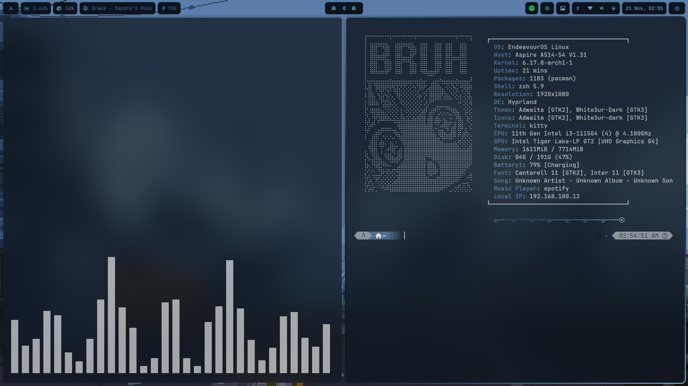

# ArchLinux Dotfiles for Hyprland

## Description

This repository contains my personal configuration files (dotfiles) for an ArchLinux setup with Hyprland as the Wayland compositor. These dotfiles are designed to provide a beautiful, productive, and highly customized desktop environment with dynamic theming powered by Pywal.

## Features

- **Hyprland**: Modern Wayland compositor with custom animations, window rules, and workspace management
- **Waybar**: Highly customized status bar with system monitoring, workspace indicators, and custom modules
- **Pywal**: Dynamic color scheme generation from wallpapers with templates for all applications
- **Kitty**: GPU-accelerated terminal emulator with Pywal color integration
- **Rofi**: Application launcher, web search, emoji picker, wallpaper selector, and power menu
- **Neofetch**: Custom system information display with personalized ASCII logo
- **Zsh + Powerlevel10k**: Powerful shell with a beautiful prompt theme
- **Fish**: Friendly interactive shell alternative
- **Ranger**: Terminal-based file manager with preview scripts
- **Micro**: Intuitive terminal-based text editor
- **Mako & SwayNC**: Notification daemons for Wayland
- **Spicetify**: Themed Spotify client
- **BetterDiscord**: Enhanced Discord with custom themes
- **Alacritty & Foot**: Alternative terminal emulators
- **Fastfetch**: Faster system information display alternative
- **Btop**: Resource monitor alternative
- **MPV**: Media player
- **nwg-shell**: Collection of GTK-based tools (drawer, look, launchers)
- **Wpaperd**: Wallpaper daemon

## Preview

### Desktop Environment




## Clean Installation Guide

### Prerequisites

Before installing these dotfiles, you need a fresh ArchLinux installation with a working internet connection.

### Step 1: Install Base System Utilities

```bash
# Update system
sudo pacman -Syu

# Install base development tools
sudo pacman -S base-devel git wget curl
```

### Step 2: Install Core Packages

Install all required packages in order:

```bash
# Display server and compositor
sudo pacman -S hyprland xdg-desktop-portal-hyprland

# Terminal and shell
sudo pacman -S kitty alacritty foot zsh fish

# Status bar and system tray
sudo pacman -S waybar

# Application launcher and menus
sudo pacman -S rofi wofi

# Notification daemon
sudo pacman -S mako swaync

# Editors
sudo pacman -S micro

# Audio
sudo pacman -S pipewire pipewire-pulse pipewire-alsa pavucontrol mpv

# Bluetooth (optional)
sudo pacman -S bluez bluez-utils blueberry

# File managers
sudo pacman -S ranger thunar

# System utilities
sudo pacman -S neofetch fastfetch htop btop polkit-kde-agent

# Screenshot utility
sudo pacman -S grim slurp wl-clipboard

# Fonts
sudo pacman -S ttf-font-awesome ttf-jetbrains-mono noto-fonts noto-fonts-emoji

# Image viewer and wallpaper
sudo pacman -S imv swaybg wpaperd

# Python and Pywal for theming
sudo pacman -S python python-pip qt5ct qt6ct kvantum
pip install pywal

# Audio visualizer (optional)
sudo pacman -S cava
```

### Step 3: Install AUR Helper (yay)

```bash
cd /tmp
git clone https://aur.archlinux.org/yay.git
cd yay
makepkg -si
cd ~
```

### Step 4: Install AUR Packages

```bash
# Spicetify for Spotify theming
yay -S spicetify-cli

# BetterDiscord (optional)
yay -S betterdiscordctl

# nwg-shell tools and other utilities
yay -S nwg-look nwg-drawer nwg-launchers nwg-dock-hyprland kanshi

# Additional Rofi themes (optional)
yay -S rofi-emoji
```

### Step 5: Install Oh-My-Zsh and Powerlevel10k

```bash
# Install Oh-My-Zsh
sh -c "$(curl -fsSL https://raw.githubusercontent.com/ohmyzsh/ohmyzsh/master/tools/install.sh)"

# Install Powerlevel10k theme
git clone --depth=1 https://github.com/romkatv/powerlevel10k.git ${ZSH_CUSTOM:-$HOME/.oh-my-zsh/custom}/themes/powerlevel10k

# Install Zsh plugins
git clone https://github.com/zsh-users/zsh-autosuggestions ${ZSH_CUSTOM:-~/.oh-my-zsh/custom}/plugins/zsh-autosuggestions
git clone https://github.com/zsh-users/zsh-syntax-highlighting.git ${ZSH_CUSTOM:-~/.oh-my-zsh/custom}/plugins/zsh-syntax-highlighting
```

### Step 6: Clone and Install Dotfiles

```bash
# Clone this repository
git clone https://github.com/notlath/dotfiles.git ~/.dotfiles

# Backup existing configs (if any)
mkdir -p ~/.config-backup
cp -r ~/.config/* ~/.config-backup/ 2>/dev/null || true
cp ~/.zshrc ~/.zshrc.backup 2>/dev/null || true

# Create symbolic links for all configurations
ln -sf ~/.dotfiles/.config/hypr ~/.config/hypr
ln -sf ~/.dotfiles/.config/waybar ~/.config/waybar
ln -sf ~/.dotfiles/.config/kitty ~/.config/kitty
ln -sf ~/.dotfiles/.config/rofi ~/.config/rofi
ln -sf ~/.dotfiles/.config/neofetch ~/.config/neofetch
ln -sf ~/.dotfiles/.config/ranger ~/.config/ranger
ln -sf ~/.dotfiles/.config/mako ~/.config/mako
ln -sf ~/.dotfiles/.config/wal ~/.config/wal
ln -sf ~/.dotfiles/.config/gtk-3.0 ~/.config/gtk-3.0
ln -sf ~/.dotfiles/.config/spicetify ~/.config/spicetify
ln -sf ~/.dotfiles/.config/BetterDiscord ~/.config/BetterDiscord
ln -sf ~/.dotfiles/.config/htop ~/.config/htop
ln -sf ~/.dotfiles/.config/alacritty ~/.config/alacritty
ln -sf ~/.dotfiles/.config/btop ~/.config/btop
ln -sf ~/.dotfiles/.config/cava ~/.config/cava
ln -sf ~/.dotfiles/.config/fastfetch ~/.config/fastfetch
ln -sf ~/.dotfiles/.config/fish ~/.config/fish
ln -sf ~/.dotfiles/.config/foot ~/.config/foot
ln -sf ~/.dotfiles/.config/gtk-2.0 ~/.config/gtk-2.0
ln -sf ~/.dotfiles/.config/gtk-4.0 ~/.config/gtk-4.0
ln -sf ~/.dotfiles/.config/kanshi ~/.config/kanshi
ln -sf ~/.dotfiles/.config/Kvantum ~/.config/Kvantum
ln -sf ~/.dotfiles/.config/micro ~/.config/micro
ln -sf ~/.dotfiles/.config/mpv ~/.config/mpv
ln -sf ~/.dotfiles/.config/nightTab ~/.config/nightTab
ln -sf ~/.dotfiles/.config/nwg-dock-hyprland ~/.config/nwg-dock-hyprland
ln -sf ~/.dotfiles/.config/nwg-drawer ~/.config/nwg-drawer
ln -sf ~/.dotfiles/.config/nwg-launchers ~/.config/nwg-launchers
ln -sf ~/.dotfiles/.config/nwg-look ~/.config/nwg-look
ln -sf ~/.dotfiles/.config/qt5ct ~/.config/qt5ct
ln -sf ~/.dotfiles/.config/qt6ct ~/.config/qt6ct
ln -sf ~/.dotfiles/.config/swaync ~/.config/swaync
ln -sf ~/.dotfiles/.config/wofi ~/.config/wofi
ln -sf ~/.dotfiles/.config/wpaperd ~/.config/wpaperd
ln -sf ~/.dotfiles/.zshrc ~/.zshrc
ln -sf ~/.dotfiles/.p10k.zsh ~/.p10k.zsh
ln -sf ~/.dotfiles/mimeapps.list ~/.config/mimeapps.list
ln -sf ~/.dotfiles/user-dirs.dirs ~/.config/user-dirs.dirs

# Copy wallpapers
mkdir -p ~/Wallpapers
cp -r ~/.dotfiles/Wallpapers/* ~/Wallpapers/

# Make scripts executable
chmod +x ~/.config/hypr/scripts/*
chmod +x ~/.config/rofi/scripts/*
chmod +x ~/.config/waybar/scripts/*
```

### Step 7: Configure Pywal

```bash
# Generate initial color scheme from a wallpaper
wal -i ~/Wallpapers/building.png

# Create cache directory
mkdir -p ~/.cache/wal
```

### Step 8: Set Zsh as Default Shell

```bash
chsh -s $(which zsh)
```

### Step 9: Configure Applications

```bash
# Initialize Spicetify (if using Spotify)
spicetify backup apply

# Log out and log back in to start Hyprland
```

### Step 10: First Launch

1. Log out of your current session
2. Select "Hyprland" from your display manager
3. Log in with your credentials
4. The startup scripts will automatically:
   - Set the wallpaper
   - Launch Waybar
   - Apply Pywal colors
   - Start necessary background services

## Configuration Structure

```
~/.dotfiles/
├── .config/
│   ├── hypr/              # Hyprland compositor configuration
│   ├── waybar/            # Status bar configuration
│   ├── kitty/             # Terminal emulator (Kitty)
│   ├── alacritty/         # Terminal emulator (Alacritty)
│   ├── foot/              # Terminal emulator (Foot)
│   ├── fish/              # Fish shell configuration
│   ├── rofi/              # Application launcher themes
│   ├── wofi/              # Wayland launcher configuration
│   ├── neofetch/          # System info display
│   ├── fastfetch/         # Fastfetch configuration
│   ├── ranger/            # File manager config
│   ├── mako/              # Notification daemon (Mako)
│   ├── swaync/            # Notification center (SwayNC)
│   ├── wal/               # Pywal templates
│   ├── spicetify/         # Spotify theming
│   ├── BetterDiscord/     # Discord theming
│   ├── micro/             # Micro text editor
│   ├── mpv/               # MPV media player
│   ├── btop/              # Btop resource monitor
│   ├── cava/              # Audio visualizer
│   ├── kanshi/            # Display profile manager
│   ├── wpaperd/           # Wallpaper daemon
│   ├── nwg-*/             # nwg-shell tools (look, drawer, dock, launchers)
│   ├── gtk-*/             # GTK 2/3/4 settings
│   ├── Kvantum/           # Qt style theme
│   └── qt*ct/             # Qt5/6 configuration tools
├── Wallpapers/            # Wallpaper collection
├── .zshrc                 # Zsh configuration
├── .p10k.zsh              # Powerlevel10k theme
└── mimeapps.list          # Default applications
```

## Keybindings

### General

| Keybinding                   | Action                    |
| ---------------------------- | ------------------------- |
| `Super + Return`             | Open terminal (Kitty)     |
| `Super + Shift + Return`     | Open terminal with Ranger |
| `Super + Q`                  | Close active window       |
| `Super + D`                  | Application launcher      |
| `Super + Space`              | Web search                |
| `Super + Semicolon / Period` | Emoji picker              |
| `Super + W`                  | Wallpaper selector        |
| `Super + X`                  | Power menu                |
| `Super + E`                  | VS Code                   |
| `Super + F`                  | Toggle fullscreen         |
| `Super + Shift + Space`      | Toggle floating           |

### Workspaces

| Keybinding              | Action                            |
| ----------------------- | --------------------------------- |
| `Super + [1-9]`         | Switch to workspace               |
| `Super + Ctrl + [1-9]`  | Move window to workspace          |
| `Super + Shift + [1-9]` | Move window silently to workspace |
| `Super + Mouse Wheel`   | Scroll through workspaces         |

### Window Management

| Keybinding            | Action         |
| --------------------- | -------------- |
| `Super + Arrow Keys`  | Move focus     |
| `Super + Mouse Left`  | Move window    |
| `Super + Mouse Right` | Resize window  |
| `Alt + Tab`           | Next workspace |

### Applications (Ctrl + Alt)

| Keybinding       | Action              |
| ---------------- | ------------------- |
| `Ctrl + Alt + T` | Kitty terminal      |
| `Ctrl + Alt + F` | Firefox             |
| `Ctrl + Alt + I` | Brave browser       |
| `Ctrl + Alt + N` | Notion              |
| `Ctrl + Alt + B` | Thunar file manager |
| `Ctrl + Alt + U` | Pavucontrol         |

### System

| Keybinding             | Action            |
| ---------------------- | ----------------- |
| `Print Screen`         | Screenshot area   |
| `Super + Print Screen` | Screenshot now    |
| `Brightness Up/Down`   | Adjust brightness |
| `Volume Up/Down`       | Adjust volume     |

## Customization

### Changing Wallpaper and Colors

The setup uses Pywal to generate color schemes from wallpapers:

```bash
# Set a new wallpaper and generate colors
wal -i ~/Wallpapers/your-wallpaper.png

# Reload Hyprland to apply changes
hyprctl reload
```

### Modifying Waybar

Edit `~/.config/waybar/config.json` for modules and `~/.config/waybar/style.css` for styling.

### Hyprland Settings

Main configuration: `~/.config/hypr/hyprland.conf`

- Adjust animations, gaps, borders, and opacity
- Modify keybindings
- Add window rules

## Waybar Modules

- **Custom Launcher**: Application menu
- **CPU & Memory**: System resource monitoring
- **Spotify**: Now playing information
- **Battery**: Battery status and percentage
- **Workspaces**: Hyprland workspace indicator
- **Network**: Connection status
- **Bluetooth**: Bluetooth management
- **Audio**: Volume control
- **Backlight**: Brightness control
- **Clock**: Date and time
- **Power Menu**: Shutdown/reboot options

## Troubleshooting

### Hyprland won't start

- Ensure all required packages are installed
- Check logs: `~/.hyprland/hyprland.log`

### Waybar not showing

- Run manually: `waybar` in terminal to see errors
- Check configuration syntax in `config.json`

### Colors not applying

- Regenerate Pywal cache: `wal -i ~/Wallpapers/your-wallpaper.png`
- Restart applications

### Scripts not working

- Ensure scripts are executable: `chmod +x ~/.config/hypr/scripts/*`
- Check script paths in `hyprland.conf`

## Credits

- Initial dotfiles structure inspired by [rchrdwllm/dotfiles](https://github.com/rchrdwllm/dotfiles)
- Hyprland configuration inspired by the Hyprland community
- Neofetch theme by [Chick2D](https://github.com/Chick2D/neofetch-themes/)
- Rofi themes customized from various sources
- Pywal by [dylanaraps](https://github.com/dylanaraps/pywal)

## License

This project is licensed under the MIT License. See the LICENSE file for details.

## Contributing

Feel free to fork this repository and customize it to your needs. If you have improvements or suggestions, pull requests are welcome!
